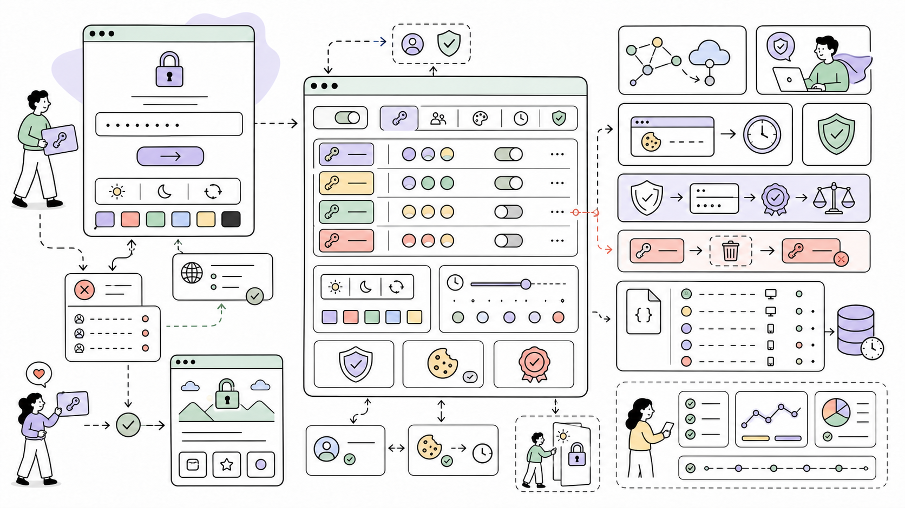

# InviteAccess

Restricts site access to visitors with a valid invite code. Designed for staging environments with multiple teams.



---

**Author:** Maxim Semenov  
**Website:** [smnv.org](https://smnv.org)  
**Email:** [maxim@smnv.org](mailto:maxim@smnv.org)

If this project helps your work, consider supporting future development: [GitHub Sponsors](https://github.com/sponsors/mxmsmnv) or [smnv.org/sponsor](https://smnv.org/sponsor/).

## Features

- Multiple invite codes — one per line, with optional human-readable labels
- Session-based auth with signed cookie fallback — visitors enter the code once, stay in for a configurable duration
- Access log — JSON log with timestamp, IP, user agent, URL and code label for every attempt
- Light / Dark / Auto theme on the access page — preference saved in localStorage
- Logged-in ProcessWire users and CLI bootstraps always bypass the gate
- Allowed pages — selected pages and descendants bypass the gate, with complete path-segment matching
- Allowed paths — configured path prefixes bypass the gate, for webhooks and other endpoints that verify their own secrets
- Clean, minimal UI — ApfelGrotezk font, processwire.com-inspired design, Bootstrap Icons
- Accent color presets — red, blue, green or black, configurable per-install

---

## Installation

1. Download the module and place `InviteAccess.module.php` and `assets/` in `site/modules/InviteAccess/`. Keep a development Git checkout outside the public document root; do not copy `.git/` or `tests/` into the site. Repository archives exclude the test suite.

2. In the ProcessWire admin, go to **Modules → Refresh**, then find **InviteAccess** and click **Install**.

3. Configure the module under **Modules → Configure → InviteAccess**.

---

## Configuration

| Field | Description | Default |
|---|---|---|
| Enable Invite Access | Master on/off switch | off |
| Invite Codes | One code per line, optional `code\|Label` format | — |
| Access Page Title | Heading shown on the access gate page | `Access Required` |
| Message | Subtext shown below the heading | `Please enter your invite code to continue.` |
| Error Message | Shown when an invalid code is submitted | `Invalid invite code. Please try again.` |
| Button Label | Text on the submit button | `Continue` |
| Style | Accent color for button and input focus border: `red`, `blue`, `green`, `black` | `red` |
| Session Duration | Hours before the visitor must re-enter their code | `1` |
| Always Accessible Pages | Pages that bypass the invite check entirely | — |
| Always Accessible Paths | One path per line, relative to the ProcessWire root; the path and its descendants bypass the invite check | — |
| Enable access logging | Write all access attempts to a JSON file | on |
| Log allowed-path requests | Record each request that bypasses the gate through an allowed path in the ProcessWire log `invite-access` | off |
| Log file path | Custom path for the log file (optional) | `site/assets/logs/invite-access.json` |

---

## Invite Code Format

Codes are defined one per line in the **Invite Codes** field. You can optionally add a pipe-separated label that appears in the access log:

```
SUMMER2025|Summer Campaign
AGENCY-PREVIEW|Agency Team
CLIENT-ACCESS|Client Preview
# this line is a comment and will be ignored
PLAINCODE
```

Labels make it easy to identify which team or campaign each access attempt belongs to when reading the log.

---

## Allowed Paths

Endpoints that authenticate on their own — payment or booking webhooks, for example — must not see the invite form: the gate answers them with the form and HTTP 200, so the sender records a successful delivery that never ran. List such paths one per line in **Always Accessible Paths**, relative to the ProcessWire root:

```
/api/webhooks/stripe/
/api/webhooks/beds24/
# this line is a comment and will be ignored
```

A listed path and its descendants bypass the gate. Matching is by complete path segment, so `/api/webhooks/stripe/` covers `/api/webhooks/stripe/event/` but not `/api/webhooks/stripe-old/`. Lines that are not unambiguous local paths, and the installation root itself, are ignored and named on the config screen. Keep each prefix as specific as its endpoint: `/api/` would exempt everything beneath it.

Enable **Log allowed-path requests** to record each bypass in the ProcessWire log `invite-access` (Setup › Logs) with method, path, the matching prefix and `REMOTE_ADDR`. It stays out of the JSON access log so webhook traffic cannot push invite attempts out of the capped file.

---

## Access Log

When logging is enabled, every access attempt is written to a JSON file (newest first). Each entry contains:

```json
{
  "time": "2026-02-27 14:32:10",
  "timestamp": 1772179930,
  "success": true,
  "code": "AGENCY-PREVIEW",
  "code_label": "Agency Team",
  "ip": "93.184.216.34",
  "ua": "Mozilla/5.0 ...",
  "url": "/about/"
}
```

Failed attempts log `"success": false` and include up to 20 characters of the submitted value as `(invalid: ...)`. Successful attempts include the invite code. Treat this file as sensitive; labels do not redact codes. Writes are locked and atomically replaced; corrupt JSON is preserved for administrator review. The log is capped at 1000 entries. The last 50 entries are also displayed directly in the module's admin config page.

---

The log directory must deny HTTP access (including on Nginx, where `.htaccess` does not apply), or set an absolute log path outside the public document root. The PHP worker needs write access to that directory to create the log, lock file and temporary replacement file. New replacement files are owner-readable/writable only. Removing the module does not delete these files.

## How It Works

The module hooks into `ProcessPageView::execute` — the earliest point in ProcessWire's request lifecycle — before any template or page rendering occurs. CLI requests return immediately. Admin, allowed-page and allowed-path exceptions require a complete path-segment match; ambiguous paths do not qualify for an exception.

On a valid code submission, the module stores the code and an expiry timestamp in the ProcessWire session and in a signed HTTP-only fallback cookie. The fallback keeps access working on sites that disable guest sessions with `$config->sessionAllow`. Subsequent requests validate that stored code without touching the database. If a code is removed from the config, any active session or fallback cookie using that code is immediately invalidated.

---

## Security Notes

- Codes are compared using `hash_equals()` to prevent timing attacks
- Fallback access cookies are signed with HMAC using ProcessWire `userAuthSalt` and marked HTTP-only. Without this secret, signing and verification fail closed. Signed access cookies are not encrypted.
- Every invite submission validates a signed, expiring double-submit CSRF token against an HTTP-only cookie, including when guest sessions are disabled. Reload forms opened before upgrading to 1.0.3.
- Log IP addresses come from `REMOTE_ADDR`. Configure trusted proxy handling at the web-server boundary; client-supplied forwarded headers are ignored.
- Use private, unpredictable codes; example codes shown in this document are public. New installations have no pre-filled codes; upgrades preserve configured codes.
- Gate and redirect responses are not cacheable. Keep reverse proxies and full-page caches from serving protected content before PHP runs.
- Allowed pages are stored as local database IDs. Reselect and verify them after importing configuration into a different database. The homepage does not exempt the entire site.
- Allowed paths are prefixes: everything beneath one is exempt, and nothing checks them against the page tree. Keep them as specific as the endpoint, and make sure every exempted endpoint authenticates on its own (signed webhooks, tokens). The installation root is never accepted.
- Direct static files are not intercepted by the PHP hook. Protect private files at the web-server boundary.
- The gate still loads fonts and icons from jsDelivr; this contacts a third party before authentication.
- The module is intended for staging environments, not as a substitute for HTTP authentication on sensitive production data. It does not provide rate limiting; enforce that at the server boundary when needed.

---

## Validation

Run from a development checkout with PHP 7.4+ and Python 3:

```sh
php -l InviteAccess.module.php
php tests/regression.php
python3 tests/http_regression.py
```

The regression tests use isolated ProcessWire API doubles and a temporary local PHP HTTP server. They cover CLI, URL and allowed-path exceptions, same-origin redirects, CSRF, cookies, log escaping, concurrent writes and guest-session modes. They do not replace verification on a disposable copy of the consuming ProcessWire site. Do not deploy `tests/` or development documentation into a public site directory.

## Author

**Maxim Semenov**
[smnv.org](https://smnv.org) · [GitHub @mxmsmnv](https://github.com/mxmsmnv)

---

## License

MIT License. See [LICENSE](LICENSE) for details.
